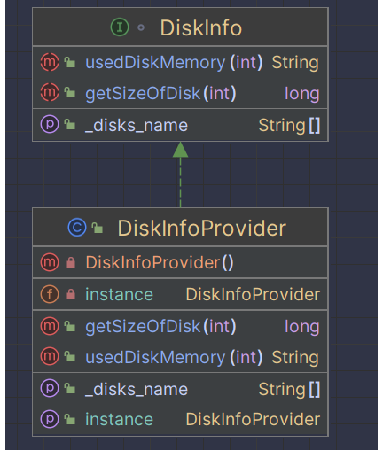
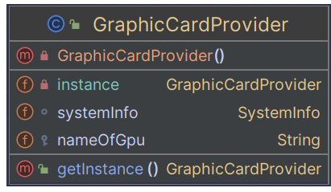
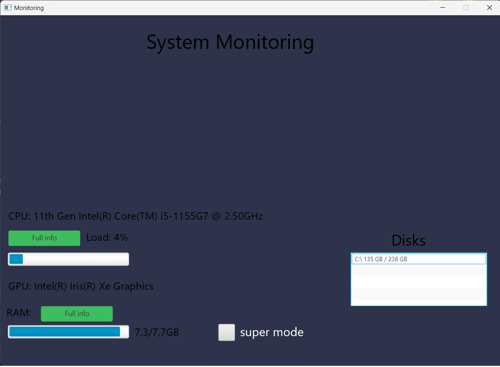
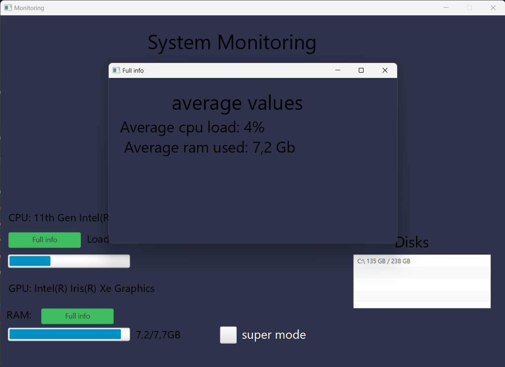
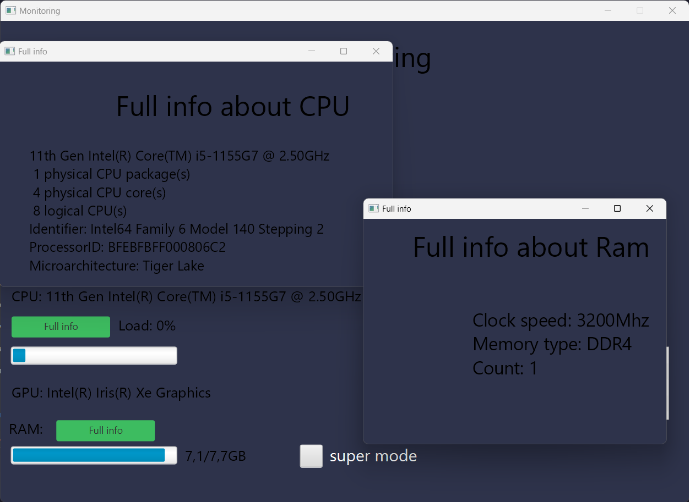

# Восканян Юрий, КИ22-17/1б
# Приложения для контроля системы
# Описание
### В рамках 5 практической работы по дисциплине "Проектирование программного обеспечения" было написано десктопное приложения для мониторинка системы.
# Функционал
### Приложение работает только на операционной системе Windows версии 10,11
### Приложение облодает следующим функционалом: 
- Информация о процессоре, оперативной памяти и видеокарте
- Загруженность  процессора и заполненность оперативной памятив реальном времени
- Список с дисковыми накопителями. Для каждого диска показывается его заполненность
- Super mode. При запуске данного режима фиксируются показатели процессора (загруженность) и оперативной памяти (заполненность). При его отключении открывается окно с средними данными каждого 
# Запуск
### Программа работает только на java версии 19, скачать его можно по ссылке: https://www.oracle.com/java/technologies/javase/jdk19-archive-downloads.html
### При установке можете указать путь
### После зайдите в `IntelliJ IDEA`, перейдите в `project structure`, `project`, и там будет поле `SDK`. Именно там надо указать путь до папки `jdk-19.0.2`, которую вы скачали
### Запустить программа можно тремя способами:
### 1. Запустить файл `Main.java`. Для этого откройте папку `app` в вашем IDE
### 2. Запустить файл  `main.jar`, который находится в папке `jar_app`. Его можно запустить, написав команду в командной строке `java -jar путь к файлу main.jar`
### 3. Запустив файл `app-1.0-SNAPSHOT.jar`, который находится по следующему пути: `app/target`. `java -jar target/app-1.0-SNAPSHOT.jar` 
### Для того, чтобы мы могли запускать `.jar` файлы с командной строки, вам надо добавить java в переменную среду. Инструкция по добавлению: `https://java-lessons.ru/common-errors/javac-is-not-recognized`

# Применение паттернов
### Был выбран паттерн Одиночка (Singleton). Так как у классов `DiskInfoProvider` и `GraphicCardProvider` один экземпляр, то было принято решение использовать паттерн Singleton, чтобы обеспечить единую точку доступа к объекту в приложении. Паттерн компоновщик не был применем, потому что в программе используется малое относительно малое количество экземпляров класса
# Пример применения паттернов в программе

# Пример использования программы

# Пример использования супер-мода

# Подробная информация о процессоре и оперативной памяти
